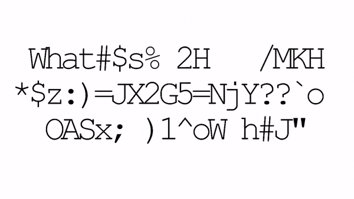

Formed on 2013, Futuremen is an instrumental-electronic music band from Mexico City. This repository contains the scripts used to
create visual content for streams, social networks and performances during the initial years of the band.

- For more visual content made with their collaboration, follow them on [YouTube](https://www.youtube.com/@futuremen/videos) or check the [live shows](https://futurem3n.com/shows/).
- Listen to them on [Spotify](https://open.spotify.com/artist/4AoMsPmkYlvgPZrF7CPnoK) or [Apple Music](https://music.apple.com/us/artist/futuremen/1346216122).

